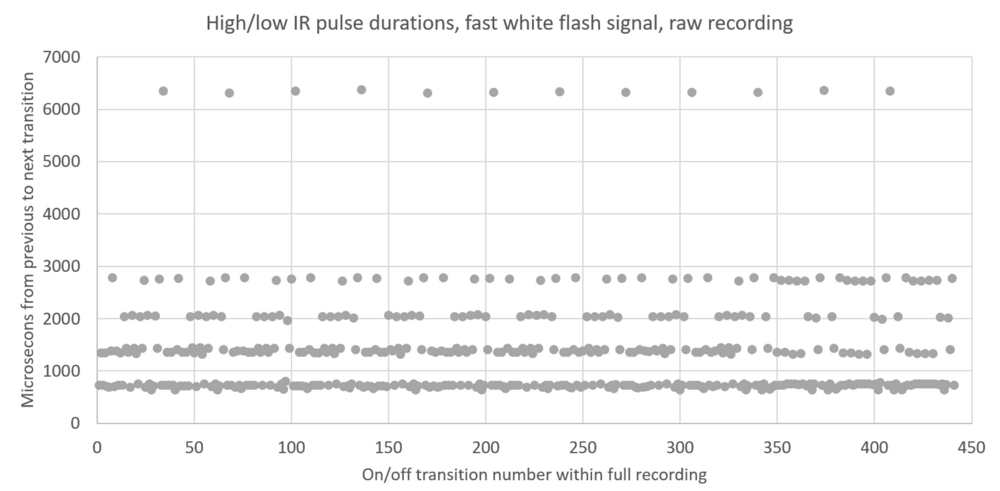
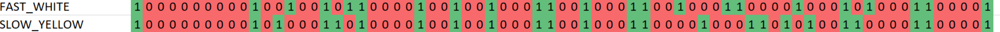
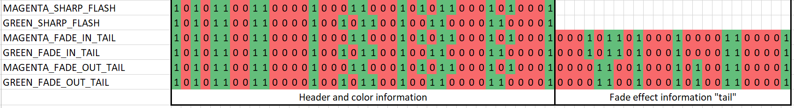

# PixMob IR Reverse Engineering Project

Hacking the PixMob infrared protocol to enable control of PixMob wristbands at home.

***A huge thanks to Zach Resmer ([@zacharesmer](https://github.com/zacharesmer)) for his help in figuring out the packet structure of the IR transmissions; Steve and Remco from Reddit for making some initial in-the-wild IR signal Flipper recordings; and Dan ([@hckrdan](https://github.com/hckrdan)) for some crafty raw recordings done with a signal analyzer.***

### Skip down to &quot;[Instructions](https://github.com/danielweidman/pixmob-ir-reverse-engineering#instructions)&quot; if you are not interested in the full write-up and just want to light up your bracelet(s)!

https://user-images.githubusercontent.com/44669548/182740123-8e16b0af-327b-44b2-a6bb-12d9a502a1fd.mp4

## Background

PixMob bracelets are LED wristbands distributed to every member of the audience at large events which all light up in sync to create massive, distributed light shows. The wristbands react to infrared commands from various types of fixed and moving transmitters. The wristbands have been used by various sports teams (including during the Super Bowl) and touring bands such as Coldplay, Shawn Mendes, Taylor Swift, Bad Bunny, The Weeknd, and Lady Gaga, to produce light shows that take advantage of the line-of-sight nature of IR light/&quot;signals&quot; to make light effects that vary by physical location in an event venue. After the event, bracelets are sometimes collected for reuse/recycling, but often attendees are left to take home the inactive bracelets.

Some prior work has been done to &quot;reactivate&quot; the PixMob bracelets after the conclusion of the event they were used in, to limited levels of success. Certain old models of PixMob bracelets can be put into a permanent motion-sensitive mode by soldering or unsoldering a pad on the PCB, but this doesn&#39;t allow the bracelet to be controlled in sync with other bracelets wirelessly. [Another project](https://jg.sn.sg/ndp-pixmob-1/) was able to upload custom firmware onto a PixMob bracelet board, but this requires taking apart the bracelet and having specialized equipment, and no IR-controlled lighting custom firmware has been released. One person has posted a [video](https://www.youtube.com/watch?v=N1cR-x\_0YAw) online wherein they demonstrate being able to turn their bracelet a couple different colors by pressing buttons on a TV remote (coincidentally generating &quot;valid&quot; codes), but the make and model of the TV remote were not specified and (as far as I&#39;m aware) no reports of reproduction have been made.

This project set out to actually reverse-engineer the production PixMob bracelet IR protocol so that PixMob devices can be controlled via IR at home, just as they are during an event.

**Hardware Notes:**

We tested with six different versions of PixMob bracelets manufactured between 2014 and 2021 from various events including Portland Trail Blazers games, Superbowl LIV, and concerts of Taylor Swift, Coldplay, and The Weeknd. Each bracelet has an IR receiver and RGB LEDs along with pseudo random number generation capabilities and persistent memory. Some models also contain a motion sensor for motion-activated effects. Feel free to open an issue if you want more specific hardware information or teardown photos. A public FCC filing for one of the models of IR transmitters used at PixMob-equipped events confirms that they work on 940nm infrared light. There is some evidence that the bracelets enter a sleep mode when not in use for a while.

**Methods:**

A Flipper Zero device was used at a Coldplay &quot;Music of the Spheres&quot; concert and a Weeknd &quot;After Hours Til Dawn&quot; concert to record some of the IR commands sent to the PixMob bracelets worn by the audience. The Flipper device was then later used to re-transmit each of the recorded signals to PixMob bracelets of various generations, and their reactions were observed. Of over 100 recorded signals, only 3 caused immediate responses on the PixMob bracelets outside of the event. It is inferred that the majority of the codes are used to transmit &quot;programming&quot; information to the bracelets, to inform how they will react to late cue signals.

Of the three initially-discovered signals:

- One produces a single yellow flash that fades out slowly
- One produces a single white flash that fades out quickly
- One produces a very slow yellow-orange fade in and out effect, but only sometimes (the rest of the transmissions leave the bracelet off).

The raw IR signal files recorded by the Flipper were inspected and analyzed. It was found that the IR signals have a carrier frequency of 38 kHz. The times between each high/low change were graphed for the signals, producing plots like the one below:

Through trial and error, it was determined that the signal recording actually contained multiple &quot;copies&quot; of the white flash signal, and the recording can be cropped down significantly and still produce the same effect. The minimum necessary segment of the recording required to elicit the white flash bracelet effect spans the samples between each of the ~6300 dots on the graph above.

From plots like this, we noticed that the transition intervals cluster around multiples of 700 microseconds. With this knowledge, we translated the signals into a binary representation, with each bit representing a 700 microsecond time interval.

All recorded signals (even those which did not immediately produce an effect when retransmitted) contained the same &quot;1000000000&quot; start sequence. From experimentation, we determined that the &quot;1000000000&quot; start sequence is not required if only sending one signal at a time without repetition—it is just used to separate individual IR codes/signal transmissions (and possibly to "wake" inactive bracelets, though transmitting any valid IR packet twice will also accomplish this). As such, the leading 1000000000 is removed from the IR signals included in this repository.

With these binary representations in hand, we wrote a program to &quot;brute-force&quot; IR signals in a targeted manner, where we selected specific ranges of bits to brute-force based on inferences made from known signals. This was done with an ESP32 development board with and IR transmitter.

By repeatedly running brute force processes, observing results on bracelets, and re-evaluating which bits to target, we were able to discover many functional IR codes to produce:

- Flashes of many different set colors and durations
  - Some fade in or out, some sharply just turn on and off
- Motion activated mode
  - Display color or cycle through rainbow colors as the bracelet is moved (persistent to battery removal and reinsertion)
- Random color effects
  - Probabilistic command that will turn on a bracelet only some of the time it&#39;s transmitted. This would be used in events to create &quot;twinkle&quot; effects, or effects that highlight a random set of attendees.
- Fades between multiple colors
- Blink between two different colors
  - Seems to adjust to how often the signal is re-transmitted, so a strobe effect of varying speed can be produced
- More complicated effects:
  - Signals that the bracelets will only react to the first of multiple consecutive transmissions
  - Signals that cycle through one of multiple colors in a set order each time they are sent
  - Signals to which bracelets will only respond if a certain amount of time has elapsed since the previous time the signal was sent
  - Signals that make it such that future light effects shown on the bracelet lead to a fade towards a set color before turning off until a stop signal is sent
  - Signals that change the colors used in certain parts of other effects until a stop signal is sent.
  - One signal makes it so a blink effect will hold its color for 60 seconds

Notably, one of the bracelets used in testing reacted to many commands by blinking between multiple colors. Another bracelet would enter a mode where it blinked red twice every few seconds after a period of not receiving any signals. It is presumed that these modes were entered based on additional programming signals sent during the event they were initially distributed at, and so far we have not discovered what those signals are or how to use most of them.

In reviewing the brute force results, we discovered that some of the light effects packets can be separated into two parts, a beginning part that specifies what color the effect should be, and an optional second part that specified if the color should be faded in and out, as well as if every bracelet should show the effect every time the code is sent or if random logic should be used to determine whether or not to show the effect. If the second part is omitted, the bracelets will just show the color briefly with no fading.

**Limitations:**

- Due to time limitations, only a few different packet structures were targeted for the brute force process. Most brute force runs were done to fine packets of lengths of 39, 63, or 73 bits, with some bits hardcoded to values that were seen to work in other signals. As such, the list of codes discovered is very far from exhaustive.
- We&#39;ve only been able to reliably discover codes that produce an immediate effect to bracelets. We know that there are many more complicated ways these bracelets are used in the wild that involves transmitting programming/light choreography information before a long light effect and then triggering those effects to run in some way.

**Next steps:**
- Learn more about the IR packet structure.
- Make the documentation more complete.
- Write a standalone Arduino library for controlling the bracelets without a computer.
- Write an installable Python library for controlling the bracelets directly on a device that runs Python code with GPIO pins (e.g. Raspberry Pi).
- Further streamline the brute force process.
  - Point a camera at the bracelets and automatically record signals that lead to effects?
  
**References and links:**
- PixMob Wash transmitter FCC filing: [https://fccid.io/2ADS4WASH](https://fccid.io/2ADS4WASH)
- Another project that tried to brute force PixMob IR signals but was not successful: [https://github.com/yeokm1/reverse-engineering-ndp2016-wristband](https://github.com/yeokm1/reverse-engineering-ndp2016-wristband). Presumably this is because the author did not have any initial valid signals to work off of, so they could not make any inferences about packet structure or on/off timing information.
- A project reverse engineering the less-common Bluetooth Low-Energy based PixMob bracelets: [https://github.com/MustBeArt/PIXMOB-reversing](https://github.com/MustBeArt/PIXMOB-reversing)
- Another project that does the equivalent of this one, but for Xylobands, a different brand of LED bracelet that uses RF instead of IR: [https://github.com/StefanKrupop/XyloShield](https://github.com/StefanKrupop/XyloShield)

### Updates (as of 12/16/2022)
There has been a lot of really good activity and progress in this repo since I first posted it! I am so appreciative of all the help from community members here.
- /u/remco has contributed some more raw recordings from a Flipper at a Coldplay concert (now we've got two sets of Coldplay recordings)
- [@hckrdan](https://github.com/hckrdan) made some recordings using a signal analyzer with a Raspberry Pi and IR receiver at an Imagine Dragons show
- I recorded some signals from the Cleveland Cavaliers 2022 season home opener
- Based on [@alexmoen955](https://github.com/alexmoen955)'s [feedback](https://github.com/danielweidman/pixmob-ir-reverse-engineering/issues/2), we now have a script that lets you configure a way to repeat commands to hold bracelet color without copying and pasting a bunch.
- [@JSMSolns](https://github.com/JSMSolns) set up a super crafty method of [controlling the bracelets with Vixen via an Arduino (https://github.com/danielweidman/pixmob-ir-reverse-engineering/issues/5)
- [@ibrunops](https://github.com/ibrunops) and I have gotten a proof-of-concept for controlling the bracelets from an [Android phone with an IR blaster](https://github.com/danielweidman/pixmob-ir-reverse-engineering/issues/10) through the irplus app.
- [@lasry1](https://github.com/lasry1), [@JulioC](https://github.com/lasry1), and I made it so we can control the bracelets via [Broadlink smart home IR devices](https://github.com/danielweidman/flipper-pixmob-ir-codes/issues/1).
- AND, last but not least, [@sean1983](https://github.com/sean1983) has made [tons of progress](https://github.com/danielweidman/pixmob-ir-reverse-engineering/issues/8) discovering many more codes, assigning RGB values, investigating packet structure, and more!

## Instructions

***If you have a Flipper Zero device and you would just like to transmit some pre-defined signals without a computer or Arduino, see this repository instead: [https://github.com/danielweidman/flipper-pixmob-ir-codes](https://github.com/danielweidman/flipper-pixmob-ir-codes).***

**Code and structure:**

This project consists of two code components:

1. Python code which tells an Arduino-compatible microcontroller (via serial) what IR signals to transmit.
2. Arduino code that listens for IR signal information over serial and transmits said signals with an IR emitter.

You will need:

1. An Arduino-compatible microcontroller.
2. A 940nm IR emitter for the Arduino. You could set up a raw IR led or use a board like the transmitter piece of [this](https://www.amazon.com/Digital-Receiver-Transmitter-Arduino-Compatible/dp/B01E20VQD8/).

Basically, the steps are:
1. Connect an IR LED/transmitter to the Arduino board.
2. Connect the Arduino to a computer by USB.
3. Upload the sketch from &quot;arduino\_sender&quot; to the Arduino. You may need to install the IRremote or IRremoteESP8266 library first. Make sure to set the IR tranmitter data pin variable and note down the port/device address (COM port on Windows) of the Arduino.
4. Set the ARDUINO_SERIAL_PORT at the top of &quot;python\_host/demo_single_effect.py&quot; or &quot;python\_host/demo_multiple_effects.py&quot; script. If using a lower-power Arduino device like an Arduino Nano, also set WAIT_BEFORE_SEND to True.
5. Run the script. Your PixMob device(s) should light up!

More specific instructions are in the README files in the relevant folders. Feel free to open an Issue if you need help.

**Replacing the batteries:**

You will, of course, need non-empty batteries in your PixMob bracelet/other device to make it work. If you received the bracelet at an event more than a few days ago, you will most likely need to replace the batteries. The process for doing this differs by bracelet type. This is easier on some models than others.

- Some bracelets have a circular battery cover with an indent that one can insert a coin into and turn counter-clockwise to remove. These take 2 CR2032s batteries.
- Some bracelets have a white plastic rectangular module embedded in a black rubber wristband. The module can be opened by pulling the two tabs on the sides outwards. After that, the batteries can be removed by inserting a pen on the bottom side of the module to push the batteries out the top. These take two CR1632 batteries.
- Other bracelets may unfortunately need to pried open and potentially taped back together.

## Contributing
Feel free to open an issue or pull request if you have any improvements to make or if you are able to glean anything new and action-worthy about the IR packet structure. I'm also happy to answer any questions about how to get things up and running.
